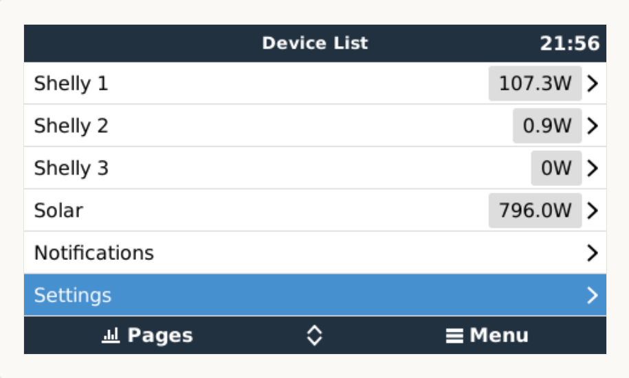
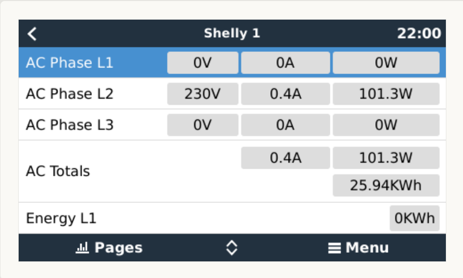
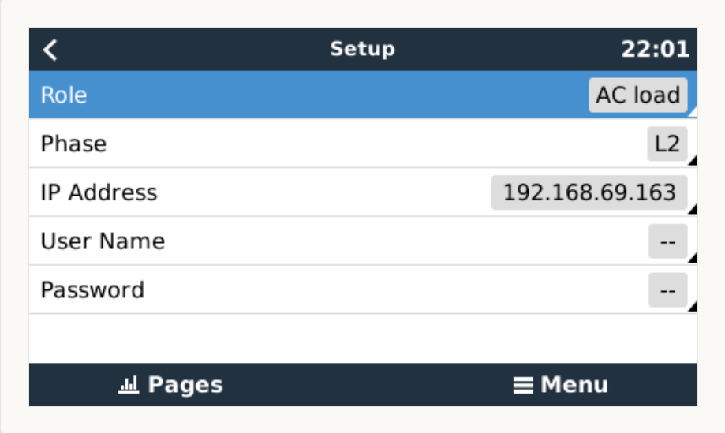
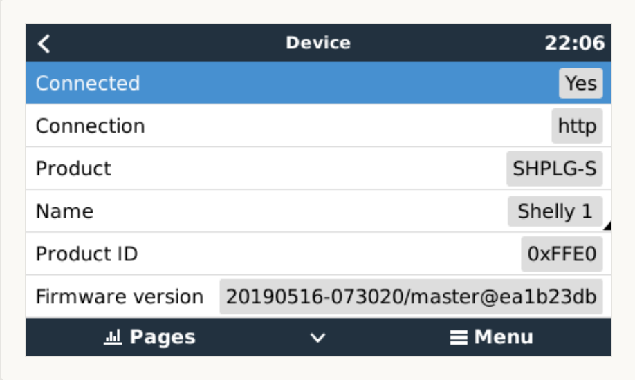

# dbus-shellyPlug
Integrate Shelly single phase energy meters into Victron Energies Venus OS

## Purpose
With the scripts in this repo it should be easy possible to install, uninstall, restart a service that connects a Shelly plug or Shelly 1PM as power meter to the VenusOS and GX devices from Victron. 

## Pictures






## Install & Configuration
### Get the code
Just grab a copy of the main branch and copy them to a folder under `/data/` e.g. `/dbus-shellyPlug`.
After that call the install.sh script.

The following script should do everything for you:
```
wget https://github.com/telekatz/venus.dbus-shellyPlug/archive/refs/heads/main.zip
unzip main.zip "venus.dbus-shellyPlug-main/*" -d /data
mv /data/venus.dbus-shellyPlug-main /data/dbus-shellyPlug
chmod a+x /data/dbus-shellyPlug/install.sh
/data/dbus-shellyPlug/install.sh
rm main.zip
```

Before installing a new version, uninstall the installed version:
```
/data/dbus-shellyPlug/uninstall.sh
```

### Change config.ini
Within the project there is a file `/data/dbus-shellyPlug/config.ini`. Create a new section for each Shelly device to be created.

| Section  | Config value | Explanation |
| ------------- | ------------- | ------------- |
| Shelly[n]  | Deviceinstance | Unique ID identifying Shelly plug/1PM in Venus OS |
| Shelly[n]  | Interval | Poll interval for meter data |

### Shelly settings
The following settings are available in the device settings menu inside Venus OS:

| Config value | Explanation |
| ------------- | ------------- |
| Role | Valid values Grid meter, PV inverter, Generator or AC load: mode of operation for the energy meter |
| Position | Only for PV inverter. Valid values AC input 1, AC input 2 or AC output: Position where the Shelly Plug/1PM is connected.
| Phase | Valid values L1, L2 or L3: represents the phase where the Shelly Plug/1PM is connected |
| IP Address | IP address of the Shelly Plug/1PM |
| User Name | Username for htaccess login - leave blank if no username/password required |
| Password | Password for htaccess login - leave blank if no username/password required |

## Used documentation
- https://github.com/victronenergy/venus/wiki Victron Energies Venus OS
- https://github.com/victronenergy/venus/wiki/dbus DBus paths for Victron namespace
- https://github.com/victronenergy/venus/wiki/dbus-api DBus API from Victron
- https://shelly-api-docs.shelly.cloud/gen1/#shelly1-shelly1pm Shelly API documentation
